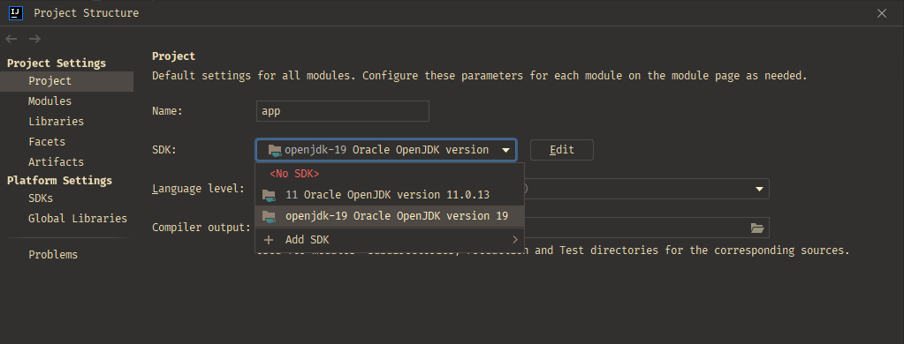
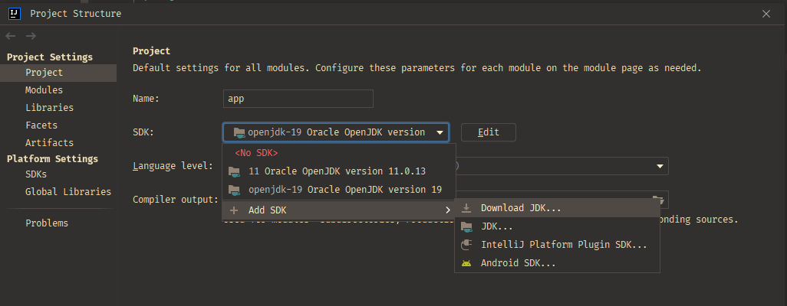
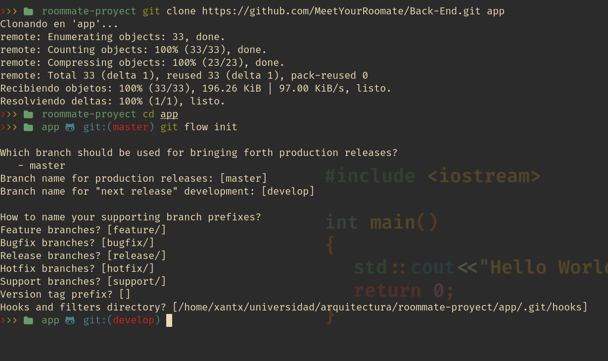

# MeetYourRoommate Api development environment settings

<!--toc:start-->
- [MeetYourRoommate Api development environment settings](#meetyourroommate-api-development-environment-settings)
  - [Editor config](#editor-config)
    - [Editor download](#editor-download)
    - [Steps to config jdk 19:](#steps-to-config-jdk-19)
  - [GitFlow config and commands](#gitflow-config-and-commands)
    - [Process reference image](#process-reference-image)
    - [Common commands](#common-commands)
      - [Git Flow Feature Commands](#git-flow-feature-commands)
    - [More](#more)
<!--toc:end-->

## Editor config

Setup Oracle OpenJdk 19 on your editor config

### Editor download

Download toolbox and Intellij IDE

[toolbox](https://www.jetbrains.com/toolbox-app/)

### Steps to config jdk 19:


**Step 1:**

Select the configuration wheel in the upper left corner and select the option "Project Structure".


**Step 2:**

Check what version of sdk you have configured.

* If your version is the same as the one shown in the image, do not change the version.

* If your version is different from the image, go to **Step 3**.




**Step 3:**

Select the "Download Sdk" option



**Step 4:**

In the list select version 19 and the "Oracle OpenJDK 19" version


## GitFlow config and commands

Configuration to use git flow commands in the development environment

**Step 1:**
Clone the repository and set the name of folder as "app" and move to the folder

```
git clone https://github.com/MeetYourRoomate/Back-End.git app
```

**Step 2:**
On the folder execute the command:
```
git flow init
```
**Step 3:**
Press Enter until the terminal finishes assigning all the names for the default branches.

### Process reference image


## Config conventional commits

execute the following command line
```
git config commit.template ./commit-structure.txt
```

### Common commands

#### Git Flow Feature Commands

- This command initializes a feature branch from the develop branch.

```
  git flow feature start '<name-of-feature>'
```
- The feature branch names have the following structure 
```
  feature/<name-of-feature>
```
- The following command is used to end a feature
```
  git flow feature finish '<name-of-feature>'
```
- The following command is used to publish a feature on your remote repository
```
  git flow feature publish '<name-of-feature>'
```

- The following command is used to get a feature published on your remote repository
```
  git flow feature pull origin '<name-of-feature>'
```
### More

[GitFlow Cheeatsheet](http://danielkummer.github.io/git-flow-cheatsheet/)

[Atlassian Documentation Gitflow basics](https://www.atlassian.com/git/tutorials/comparing-workflows/gitflow-workflow)
